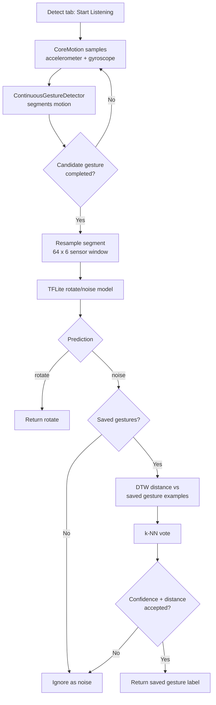
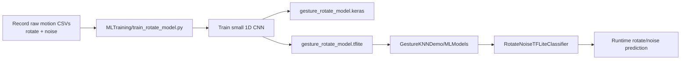

# Gesture KNN Demo

SwiftUI iOS demo for motion gesture recognition with a hybrid ML pipeline:

- TensorFlow Lite detects the built-in `rotate` gesture first.
- User-recorded gestures are matched afterward with DTW + k-NN.
- CoreMotion provides live accelerometer and gyroscope samples.

Test on a real iPhone. The iOS Simulator does not provide normal device-motion data.

## Solution Flow

## App Flow

1. Open the **Register** tab and record custom gestures.
2. Open the **Detect** tab and tap **Start Listening**.
3. If the motion is `rotate`, the TFLite model returns it immediately.
4. If the model sees `noise`, the app checks saved user gestures with DTW + k-NN.

## ML Training Flow

Use this only when the built-in rotate/noise model needs to be retrained.

## Project Map

- `GestureKNNDemo/App`: app entry point, tabs, app shortcut intent.
- `GestureKNNDemo/Motion`: CoreMotion recording and continuous segmentation.
- `GestureKNNDemo/ML`: TFLite wrapper, DTW, and k-NN logic.
- `GestureKNNDemo/MLModels`: bundled rotate/noise `.tflite` model and labels.
- `GestureKNNDemo/Storage`: saved custom gesture persistence.
- `GestureKNNDemo/Views`: SwiftUI screens.
- `MLTraining`: optional Python training scripts and sample CSV data.

## Run

1. Open `GestureKNNDemo.xcodeproj` in Xcode.
2. Select a real iPhone.
3. Update signing if needed.
4. Build and run.
